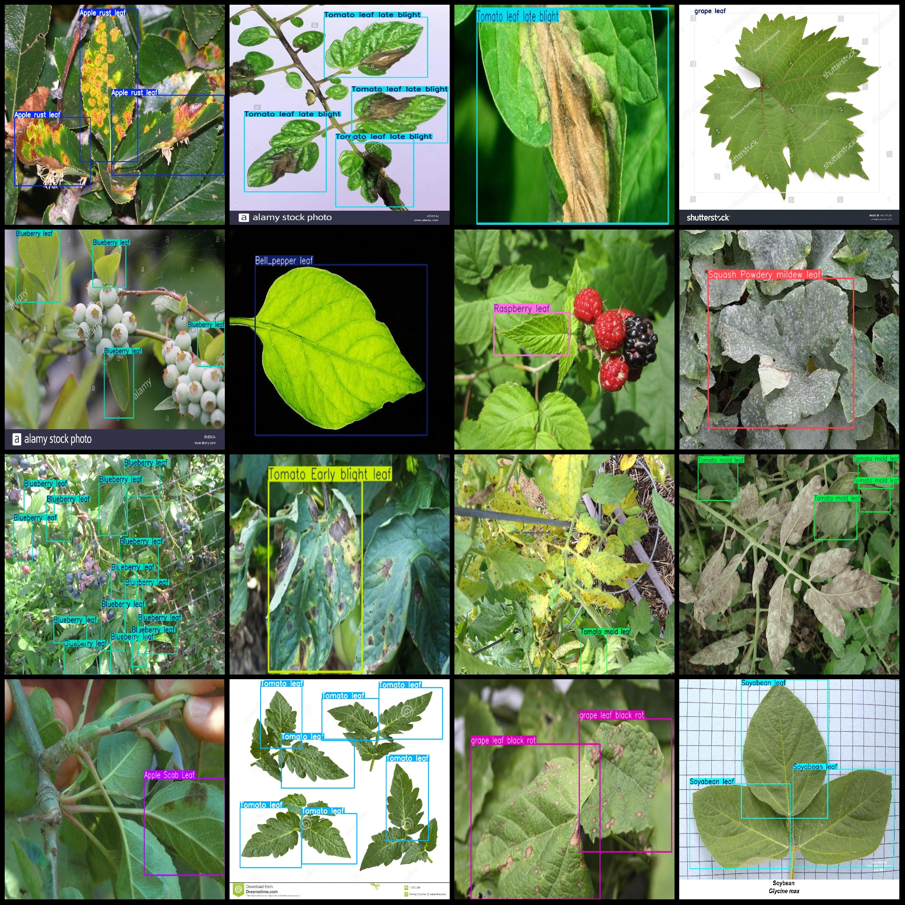
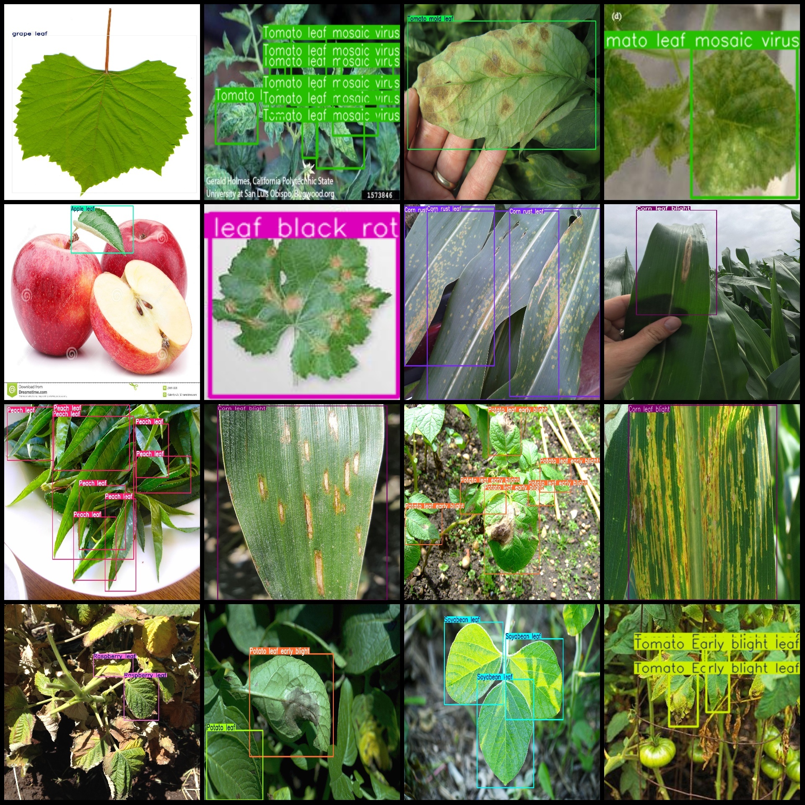

# Crop Leaf Disease Detection Dataset VOC + YOLO format 25,58 images with 30 categories

Dataset format: Pascal VOC format + YOLO format (txt file, jpg images and corresponding VOC format xml files and yolo format txt files without split path)
Number of images (jpg files): 2558
Number of labels (xml files): 2558
Number of labels (txt files): 2558
Number of label categories: 30
Label category names (note that the order in yolo format is not consistent with this, but according to the "labels" folder's "classes.txt"): ["Apple Scab Leaf", "Apple leaf", "Apple rust leaf", "Bell_pepper leaf", "Bell_pepper leaf spot", "Blueberry leaf", "Cherry leaf", "Corn Gray leaf spot", "Corn leaf blight", "Corn rust leaf", "Peach leaf", "Potato leaf", "Potato leaf early blight", "Potato leaf late blight", "Raspberry leaf", "Soyabean leaf", "Soybean leaf", "Squash Powdery mildew leaf", "Strawberry leaf", "Tomato Early blight leaf", "Tomato Septoria leaf spot", "Tomato leaf", "Tomato leaf bacterial spot", "Tomato leaf late blight", "Tomato leaf mosaic virus", "Tomato leaf yellow virus", "Tomato mold leaf", "Tomato two spotted spider mites leaf", "grape leaf", "grape leaf black rot"]
Number of boxes for each category:
Apple Scab Leaf (apple scab scab disease leaf) boxes = 171, occupying images = 93
Apple leaf (apple leaf) boxes = 247, occupying images = 91
Apple rust leaf (apple rust leaf) boxes = 178, occupying images = 88
Bell_pepper leaf (bell pepper leaf) boxes = 323, occupying images = 61
Bell_pepper leaf spot (bell pepper leaf spot) boxes = 263, occupying images = 71
Blueberry leaf (blueberry leaf) boxes = 838, occupying images = 114
Cherry leaf (cherry leaf) boxes = 239, occupying images = 57
Corn Gray leaf spot (corn gray spot) boxes = 76, occupying images = 65
Corn leaf blight (368 frames, 190 images)
Corn rust leaf (127 frames, 116 images)
Peach leaf (614 frames, 111 images)
Potato leaf (11 frames, 3 images)
Potato leaf early blight (318 frames, 114 images)
Potato leaf late blight (245 frames, 104 images)
Raspberry leaf (556 frames, 119 images)
Soyabean leaf (266 frames, 65 images)
Soybean leaf (15 frames, 1 image)
Squash Powdery mildew leaf (256 frames, 132 images)
Strawberry leaf (492 frames, 96 images)
Tomato Early blight leaf (212 frames, 88 images)
Tomato Septoria leaf spot (426 frames, 148 images)
Tomato leaf (400 frames, 73 images)
Tomato leaf bacterial spot (280 frames, 113 images)
The number of frames for Tomato leaf late blight (late blight of tomato leaves) is 218, and the number of images is 110.
Tomato leaf mosaic virus (TuMV) box count = 261, images = 55
Tomato leaf yellow virus (TLV) is a viral disease of tomato plants. It is characterized by yellowing of leaves and can cause stunted growth and reduced fruit production. The number of frames for TLV is 801, and the number of images associated with this frame is 74.
Tomato mold leaf frame = 295, occupy picture number = 92
Tomato two spotted spider mites leafframe count = 2, image count = 2
Grape leafframe count = 220, image count = 69
Grape leaf black rotframe count = 133, image count = 64
Total frames: 8851
Image resolution: Multi-resolution images, such as 4320x3240, 320x320, etc.
Use annotation tool: labelImg
Annotation rules: Draw a rectangle around the class for annotation.
Important notes: The dataset must be divided into training, validation, and test sets, which should be done manually.
Special Notice: This dataset does not provide any guarantees regarding the accuracy of models or weight files trained on it.
Preview of the image:
## Images

Here is a pay link on Stripe ( https://buy.stripe.com/3cs8yP7sY87d0vu9AB ). Please contact me lonlonago@foxmail.com after funding $89, and I will send you a complete data files , thank you!

